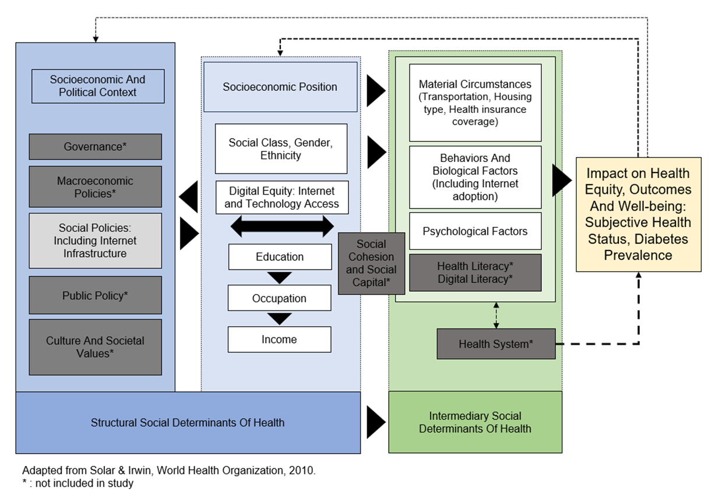

# eHealthEquity
Research Notebooks, Data Sources, and Geospatial Tool Development of eHealthEquity research.

*Dissertation Research of Matthew Farmer MSN, RN
 University of Missouri, Sinclair School of Nursing* [@mfarme](https://github.com/mfarme/mfarme)

## Aim
Assess and analyze quantifiable evidence that Internet access and adoption is a social determinant of health in United States counties and describe the interaction effects between other social determinants.
- Why publish on Github? To promote replication with different or new data, grow research in this domain, and do science in the open. 

### Research Question 1 
- What is the relationship between Internet adoption and diabetes prevalence in United States counties, controlling for other social determinants of health?
### Research Question 2 
- What is the relationship between Internet adoption and fair or poor self-report health status ratings in United States counties, controlling for other social determinants of health? 
### Research Question 3
- Do machine learning algorithms produce a better fit (lower variance and bias) compared to linear regression models? 

---
### Libraries Used
* [Pandas](https://pandas.pydata.org/)
* [Numpy](https://numpy.org/)
* [cenususdis](https://github.com/vengroff/censusdis/tree/main)
* [sodapy](https://github.com/xmunoz/sodapy)
* [add more as notebooks develop]

## Data Sources and Variables
| Variables  | Level        | Concept                                       | Measure                                                                                       | Source               | Note                                                                        |
|------------|--------------|-----------------------------------------------|------------------------------------------------------------------------------------------------|----------------------|-----------------------------------------------------------------------------|
| RQ1 DV     | Outcome      | Diabetes Prevalence                           | Diagnosed diabetes among adults aged >=18 years; % of county                                   | BRFSS/PLACES 2021    | Upper and Lower confidence; crude and age-adjusted                          |
| RQ2 DV     | Outcome      | Self-Reported Health Status                   | Fair or poor self-rated health status among adults aged >=18 years; % of county                | BRFSS/PLACES 2021    | Upper and Lower confidence; crude and age-adjusted                          |
| IV         | Intermediary | Behaviors and Biological Factors: Internet Adoption| Households with internet (Broadband) subscription; %                                    | ACS 5Y 2021          | proportion and raw count with margin of error                               |
| IV         | Structural   | Internet Access: Social Policy/Digital Equity | Internet availability (<25/3 mbps)                                                           | NTIA                 | Endogenous variable                                                         |
| Covariates | Structural   | Gender, Age, Ethnicity                        | Aged 65 & Older, Gender, Race, Ethnicity                                                      | ACS 5Y 2021          | proportion and raw count with margin of error                               |
| Covariates | Structural   | Education, Occupation, Income                 | Educational attainment, Industry employed, employment status, income in past 12 months below poverty level | ACS 5Y 2021          | proportion and raw count with margin of error                               |
| Covariates | Intermediary | Material Circumstances                        | Transportation, Housing type, Health insurance coverage                                       | ACS 5Y 2021; BRFSS 2021 (insurance)| proportion and raw count with margin of error                  |
| Covariates | Intermediary | Behaviors and Biological Factors              | Obesity, smoking status, visit to doctor in past year (adults)                                | BRFSS/PLACES 2021    | Upper and Lower confidence; crude and age-adjusted                          |
| Covariates | Intermediary | Psychological Factors                         | Depression among adults, Mental health “not good” for >= 14 days among adults                  | BRFSS/PLACES 2021    | Upper and Lower confidence; crude and age-adjusted                          |
---

## Data Sources

* [American Community Survey (ACS)](https://www.census.gov/programs-surveys/acs)
    * [ACS 5-Year Data Profiles](https://www.census.gov/data/data-tools.html)
    * [ACS 5-Year Data Profiles API](https://www.census.gov/data/developers/data-sets/acs-5year.html)
* [BRFSS/PLACES](https://www.cdc.gov/brfss/brfssprevalence/index.html)
    * [BRFSS/PLACES API](https://dev.socrata.com/foundry/data.cdc.gov/4qvr-3h4f)
* [NTIA](https://www.ntia.gov/data/broadband-data)
    *  [NTIA API](https://www.ntia.gov/data/broadband-data/api)
* [RUCA Codes](https://www.ers.usda.gov/data-products/rural-urban-commuting-area-codes.aspx)

## Conceptual Framework
* [WHO Social Determinants of Health Framework](https://www.who.int/teams/social-determinants-of-health)

