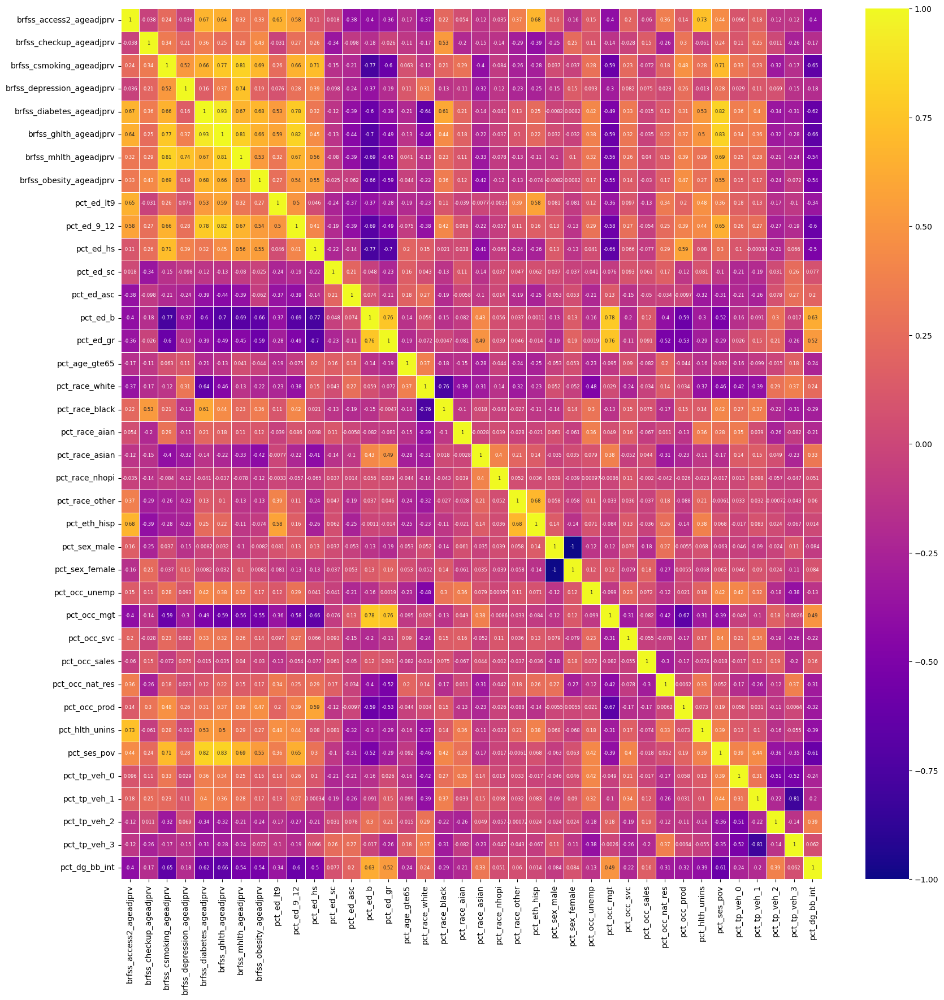
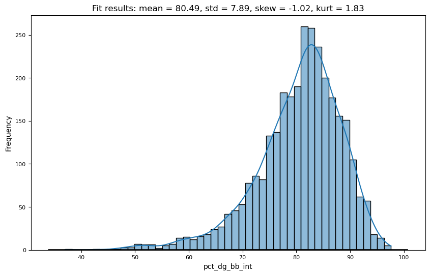
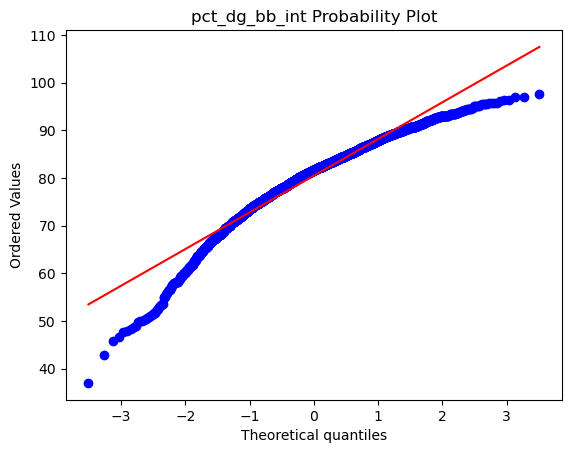
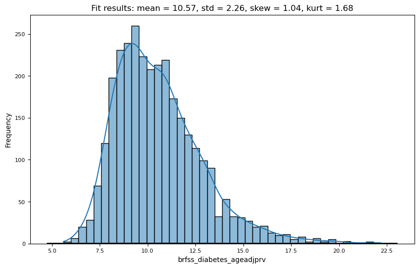
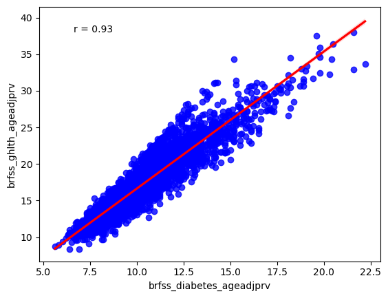
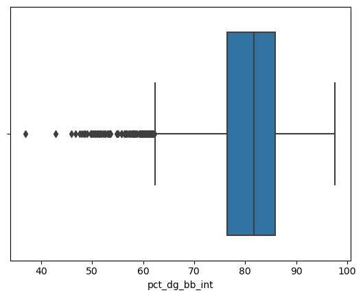
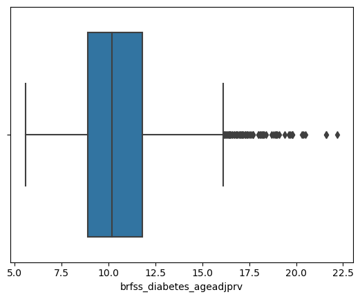

# Exploratory Data Analysis Notes
## Table of Contents
1. [Introduction](#introduction)
2. [Data Exploration](#data-exploration)
3. [Data Visualization](#data-visualization)

## Introduction
The combined ACS and BRFSS data were assessed for missing values, outliers, and data types. The data were then cleaned and prepared for analysis. The data were then explored and visualized to gain a better understanding of the data and to identify any trends or patterns. 
BRFSS Data were limited to age-adjusted prevelence estimates for all features. 

## Data Exploration
Data type: all data were numeric except for the state and county names. The state and county names were object data types.

Data Shape: the number of counties (including large individual cities) assessed was 3,076. This excludes Florida and Puerto Rico. Florida did not have data for BRFSS 2021, and PR was excluded in the study. The number of total features was 40.

Missing Values: none of the features had missing values.

Descriptive Statistics by feature:
| Feature                   | Mean      | Std       | Skew     | Kurt     | Normally Distributed |
|---------------------------|-----------|-----------|----------|----------|-----------------------|
| brfss_access2_ageadjprv   | 12.257965 | 5.642848  | 2.107293 | 6.632905 | **No**                    |
| brfss_checkup_ageadjprv    | 72.327796 | 4.455203  | -0.768270| 0.375633 | Yes                    |
| brfss_csmoking_ageadjprv   | 19.000260 | 4.080862  | 0.474461 | 1.431582 | Yes                    |
| brfss_depression_ageadjprv | 23.043173 | 3.283014  | 0.007416 | -0.097413| Yes                   |
| brfss_diabetes_ageadjprv   | 10.566775 | 2.261324  | 1.039886 | 1.685440 | Yes                    |
| brfss_ghlth_ageadjprv      | 17.723927 | 4.563984  | 0.748941 | 0.463330 | Yes                    |
| brfss_mhlth_ageadjprv      | 17.146261 | 2.128703  | 0.083138 | -0.163402| Yes                   |
| brfss_obesity_ageadjprv    | 37.422172 | 4.545114  | -0.602845| 1.110271 | Yes                    || pct_ed_lt9                 | 4.424447  | 3.466028  | 3.690470 | 29.472990| **No**                    |
| pct_ed_9_12                | 7.593596  | 3.446065  | 0.947911 | 1.659929 | Yes                  |
| pct_ed_hs                  | 33.964564 | 7.513747  | -0.282498| 0.004606 | Yes                   |
| pct_ed_sc                  | 21.509363 | 3.913367  | 0.178423 | 0.709722 | Yes                   |
| pct_ed_asc                 | 9.503674  | 2.962155  | 1.174695 | 9.827137 | Yes                   |
| pct_ed_b                   | 14.848895 | 5.826326  | 0.950158 | 1.148679 | Yes                   |
| pct_ed_gr                  | 8.155039  | 4.715969  | 2.122896 | 7.336016 | **No**                     |
| pct_age_gte65              | 19.137386 | 4.629210  | 0.605006 | 1.110419 | Yes                   |
| pct_race_white             | 80.523960 | 17.189236 | -1.505021| 2.103693 | **No**                     |
| pct_race_black             | 8.825975  | 14.450013 | 2.349037 | 5.504620 | **No**                    |
| pct_race_aian              | 1.982055  | 7.912436  | 7.696848 | 66.658238| **No**                    |
| pct_race_asian             | 1.419018  | 2.931693  | 6.809628 | 65.935254| **No**                    |
| pct_race_nhopi             | 0.099740  | 0.537195  | 20.417653| 505.682630| **No**                    |
| pct_race_other             | 2.433453  | 3.969916  | 4.873134 | 35.043984| **No**                    |
| pct_eth_hisp               | 9.681307  | 14.016291 | 3.057726 | 10.738296| **No**                    |
| pct_sex_male               | 50.343108 | 2.396472  | 2.497769 | 11.367276| **No**                    |
| pct_sex_female             | 49.656892 | 2.396472  | -2.497769| 11.367276| **No**                   |
| pct_occ_unemp              | 2.954356  | 1.378524  | 2.202239 | 16.626870| Yes                   |
| pct_occ_mgt                | 33.597269 | 7.149974  | 0.924736 | 1.731558 | Yes                   |
| pct_occ_svc                | 17.534200 | 3.732485  | 0.848384 | 2.488990 | Yes                   |
| pct_occ_sales              | 19.596196 | 3.020731  | -0.465568| 2.321047 | Yes                   |
| pct_occ_nat_res            | 12.379681 | 4.179799  | 1.088463 | 3.418339 | Yes                   |
| pct_occ_prod               | 16.893433 | 5.916437  | 0.398288 | 0.025463 | Yes                   |
| pct_hlth_unins             | 9.608127  | 5.150514  | 1.547119 | 4.177119 | **No**                     |
| pct_ses_pov                | 14.401658 | 6.152201  | 1.196015 | 3.043360 | Yes                   |
| pct_tp_veh_0               | 6.078316  | 4.511482  | 7.584077 | 97.263805| **No**                     |
| pct_tp_veh_1               | 29.101398 | 5.722047  | 0.219941 | 2.213234 | Yes                   |
| pct_tp_veh_2               | 36.813687 | 4.610280  | -0.954653| 5.971907 | Yes                   |
| pct_tp_veh_3               | 28.003706 | 7.584240  | 0.365086 | 1.088335 | Yes                   |
| pct_dg_bb_int              | 80.485826 | 7.894527  | -1.021739| 1.831595 | Yes                   |

## Univariate Analysis
### Correlation (top and bottom 10)

|      feature1     |         feature2        | correlation |
|-------------------|-------------------------|-------------|
|   pct_eth_hisp    |     pct_race_other      |   0.682311  |
| brfss_obesity_ageadjprv | brfss_diabetes_ageadjprv |   0.683073  |
| brfss_mhlth_ageadjprv |      pct_ses_pov        |   0.688144  |
| brfss_csmoking_ageadjprv | brfss_obesity_ageadjprv |   0.692554  |
| brfss_csmoking_ageadjprv |      pct_ses_pov        |   0.710255  |
|      pct_ed_hs     | brfss_csmoking_ageadjprv |   0.713761  |
| brfss_access2_ageadjprv |    pct_hlth_unins      |   0.730730  |
| brfss_depression_ageadjprv | brfss_mhlth_ageadjprv |   0.735761  |
|    pct_occ_mgt    |        pct_ed_gr         |   0.756401  |
|      pct_ed_b      |        pct_ed_gr         |   0.764301  |
| brfss_csmoking_ageadjprv | brfss_ghlth_ageadjprv |   0.769268  |
|   pct_ed_9_12     | brfss_diabetes_ageadjprv |   0.776313  |
|    pct_occ_mgt    |         pct_ed_b         |   0.777645  |
| brfss_ghlth_ageadjprv | brfss_mhlth_ageadjprv |   0.812276  |
| brfss_csmoking_ageadjprv | brfss_mhlth_ageadjprv |   0.813041  |
|   pct_ed_9_12     | brfss_ghlth_ageadjprv |   0.820532  |
| brfss_diabetes_ageadjprv |      pct_ses_pov        |   0.824549  |
|    pct_ses_pov    | brfss_ghlth_ageadjprv |   0.827998  |
| brfss_diabetes_ageadjprv | brfss_ghlth_ageadjprv |   0.927572  |
|   pct_sex_male    |    pct_sex_female       |  -1.000000  |
|  pct_tp_veh_3     |     pct_tp_veh_1       |  -0.807292  |
|      pct_ed_b      | brfss_csmoking_ageadjprv |  -0.771570  |
|      pct_ed_b      |       pct_ed_hs         |  -0.770391  |
| pct_race_black    |    pct_race_white       |  -0.757329  |
|      pct_ed_b      | brfss_ghlth_ageadjprv |  -0.704377  |
|     pct_ed_hs     |         pct_ed_gr         |  -0.701566  |
|   pct_ed_9_12     |         pct_ed_b         |  -0.689861  |
| brfss_mhlth_ageadjprv |        pct_ed_b         |  -0.689738  |
|  pct_occ_prod     |      pct_occ_mgt        |  -0.670625  |
|      pct_ed_b      | brfss_obesity_ageadjprv |  -0.662791  |
| pct_dg_bb_int     | brfss_ghlth_ageadjprv |  -0.662506  |
|  pct_occ_mgt     |         pct_ed_hs         |  -0.655527  |
| pct_dg_bb_int     | brfss_csmoking_ageadjprv |  -0.653152  |
| brfss_diabetes_ageadjprv |    pct_race_white      |  -0.640247  |
| brfss_diabetes_ageadjprv |      pct_dg_bb_int     |  -0.620441  |
|    pct_ses_pov    |      pct_dg_bb_int     |  -0.606104  |
| brfss_csmoking_ageadjprv |       pct_ed_gr        |  -0.599543  |
|   pct_ed_9_12     |      pct_dg_bb_int     |  -0.598564  |

# Discussion

- Smoking is correlated with poverty and education (HS). Mental health correlated with depression. Management occupation correlated with graduate degree. Smoking status correlated with General Health. Diabetes and general health correlated with education 9-12th grade. Bach degree correlated with management occupation. General health correlated with mental health. poverty correlated with diabetes and general health. General health highly correlated with diabetes. 
Negative correlations with bach degree and smoking, general health, mental health, and obesity. Negative correlation with general health and internet access. Negative correlation with internet and smoking status. 
- Education has high correlations with health, occupation, adn poverty. 
- Poverty has high correlations with health, occupation, and education.
- These are complex and multi-faceted relationships. Will need to address these complexities in analysis.
- Diabetes prevalence is highly correlated with general health. Due to the linear relationship, RQ 2 will be dropped. 

## Other Data Visualization

