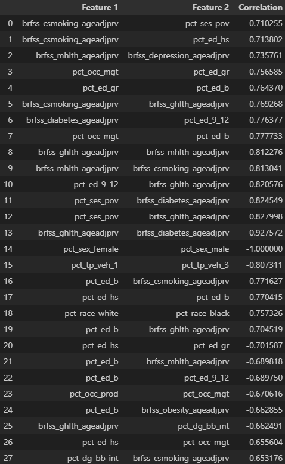

# Exploratory Data Analysis Notes
## Table of Contents
1. [Introduction](#introduction)
2. [Data Exploration](#data-exploration)
3. [Data Visualization](#data-visualization)

## Introduction
The combined ACS and BRFSS data were assessed for missing values, outliers, and data types. The data were then cleaned and prepared for analysis. The data were then explored and visualized to gain a better understanding of the data and to identify any trends or patterns.

## Data Exploration
Data type: all data were numeric except for the state and county names. The state and county names were object data types.

Data Shape: the number of counties (including large individual cities) assessed was 3,076. This excludes Florida and Puerto Rico. Florida did not have data for BRFSS 2021, and PR was excluded in the study. The number of total features (including CI) was 136. Without CI, the number of features is 46. Poverty did not have CI. 

Missing Values: Missing values were identified in Upper and Lower CI columns. Ethicity-Hispanic had the highest amount of missing CI values (2620). Age greater than 65, and male/female features were the other feautres with missing CI values, with 90 and 13 missing values respectively.

Descriptive Statistics by feature:
- BRFSS Access (Uninsured): Mean 0.12, std 0.06, skew 2.11, kurt 6.62. Not normally distributed, high peaks and right skew.
- BRFSS Checkup w/ Doctor: mean 0.72, std 0.04, skew -0.77, kurt 0.37. Appears normally distributed.
- BRFSS Current Smoking: Mean 0.19, std 0.04, skew 0.47, kurt 1.43. Appears normally distributed. 
- BRFSS Depression: Mean 0.23, std 0.03, skew 0.01, kurt = -0.1. Appears normally distributed.
- BRFSS Diabetes: Mean 0.11, std 0.02, skew = 1.04, kurt = 1.68. Appears normally distributed with a slight right skew.
- BRFSS General Health(poor): Mean 0.18, std 0.05, skew 0.75, kurt 0.46. Appears normally distributed. 
- BRFSS Mental Health(poor): Mean 0.17, std 0.02, skew 0.08, kurt -0.17. Appears normally distributed.
- BRFSS Obesity: mean 0.37, std 0.05, skew -0.60, kurt 1.11. Appears normally distributed.
- ACS Poverty: mean 0.14, std 0.06, skew 1.20, kurt 3.04. Appears normally distributed with peakedness.
- ACS Age > 65: mean 0.19, std 0.05, skew 0.60, kurt 1.11. Appears normally distributed. 
- ACS Race White: mean 0.81, std 0.17, skew -1.50, kurt 2.10. Not normal distribution. Left skew and peaked. 
- ACS Race Black: mean 0.09, std 0.14, skew 2.35, kurt 5.50. Not normally distributed, right skew and highly peaked. 
- ACS Race American Indian, Alaskan Native: mean 0.02, std 0.08, skew 7.69, kurt 66.56. Not normally distributed, right skew and significantly peaked.
- ACS Race Asian: mean 0.01, std 0.03, skew 6.81, kurt 65.90. Not normally distributed, right skew with significant peak. 
- ACS Race Native Hawaiian and Other Pacific Islander: mean 0.00, std 0.01, skew 20.46, kurt 505.81. Not normally distributed, heavily right skewed with significant peak.
- ACS Race other: mean 0.02, std 0.04, skew 4.87, kurt 34.94. Not normally distrbuted, skewed right and significantly peaked. 
- ACS Ethnicity Hispanic: mean 0.10, std 0.14, skew 3.06, kurt 10.72. Not normally distributed, skewed right, hihgly peaked. 
- ACS Health Insurance (uninsured): mean 0.09, std 0.05, skew 1.61, kurt 4.59. Appears normally distributed with right skew and peakedness.
- ACS Sex Male: mean 0.50, std 0.02, skew 2.50, kurt 11.36. Normal distribution with slight right skew and highly peaked. 
- ACS Sex Female: mean 0.50, std 0.02, skew -2.50, kurt 11.36. Normal distribution with slight left skew and highly peaked.
- ACS Education (Less than 9th Grade): mean 0.04, std 0.03, skew 3.69, kurt 29.44. Distribution is somewhat normal with right skew but high peakedness.
- ACS Education (9-12th): Mean 0.08, std 0.03, skew 0.95, kurt 1.65. Appears normally distributed.
- ACS Education High School: mean 0.34, 0.08, skew -0.28, kurt 0.00. Appears normally distributed.
ACS Education Some College: mean 0.22, std 0.04, skew 0.18, kurt 0.70. Appears normally distributed.
- ACS Education Associates's Degree: mean 0.10, std 0.03, skew 1.17, kurt 9.79. Appears normally distributed with peak.
- ACS Education Bachelor's Degree: mean 0.15, std 0.06, skew 0.95, kurt 1.15. Appears normally distributed.
- ACS Eduacation Graduate Degree: mean 0.08, std 0.05, skew 2.12, kurt 7.32. Appears normally distributed with right skew and peak.
- ACS Occupation Unemployed: mean 0.06, std 0.03, skew 2.96, kurt 22.15. Appears normally distributed with right skew and peak.
- ACS Occupation Management: mean 0.34, std 0.07, skew 0.92, kurt 1.73. Appears normally distributed.
- ACS Occupation Service: mean 0.18, std 0.04, skew 0.85, kurt 2.48. Appears normally distributed.
- ACS Occupation Sales: mean 0.20, std 0.03, skew -0.46, kurt 2.32. Appears normally distributed.
- ACS Occupation Natural Resources: mean 0.12, std 0.04, skew 1.09, kurt 3.42. Appears normally distributed with small peak.
- ACS Occupation Production: mean 0.17, std 0.06, skew 0.40, kurt 0.02. Appears normally distributed.
- ACS Transportation 0 vehicles: mean 0.06, std 0.05, skew 7.58, kurt 97.12. Not normally distributed, right skew and highly peaked.
- ACS Transportation 1 vehicle: mean 0.29, std 0.06, skew 0.22, kurt 2.21. Appears normally distributed.
- ACS Transportation 2 vehicles: mean 0.37, std 0.05, skew -0.95, kurt 5.96. Appears normally distributed.
- ACS Transportation 3 vehicles: mean 0.28, std 0.08, skew 0.36, kurt 1.08. Appears normally distributed.
- ACS Broadband Internet Subscription: mean 0.80, std 0.08, skew -1.02, kurt 1.82. Appears normally distributed.

## Univariate Analysis
### Correlation (top and bottom 10)

# Discussion

- Smoking is correlated with poverty and education (HS). Mental health correlated with depression. Management occupation correlated with graduate degree. Smoking status correlated with General Health. Diabetes and general health correlated with education 9-12th grade. Bach degree correlated with management occupation. General health correlated with mental health. poverty correlated with diabetes and general health. General health highly correlated with diabetes. 
Negative correlations with bach degree and smoking, general health, mental health, and obesity. Negative correlation with general health and internet access. Negative correlation with internet and smoking status. 
- Education has high correlations with health, occupation, adn poverty. 
- Poverty has high correlations with health, occupation, and education.
- These are complex and multi-faceted relationships. Will need to address these complexities in analysis.

- Non Normal Distributions: BRFSS Access (Uninsured), All race and ethnicity variables, and 0 vehicles variable. 

## Data Visualization
